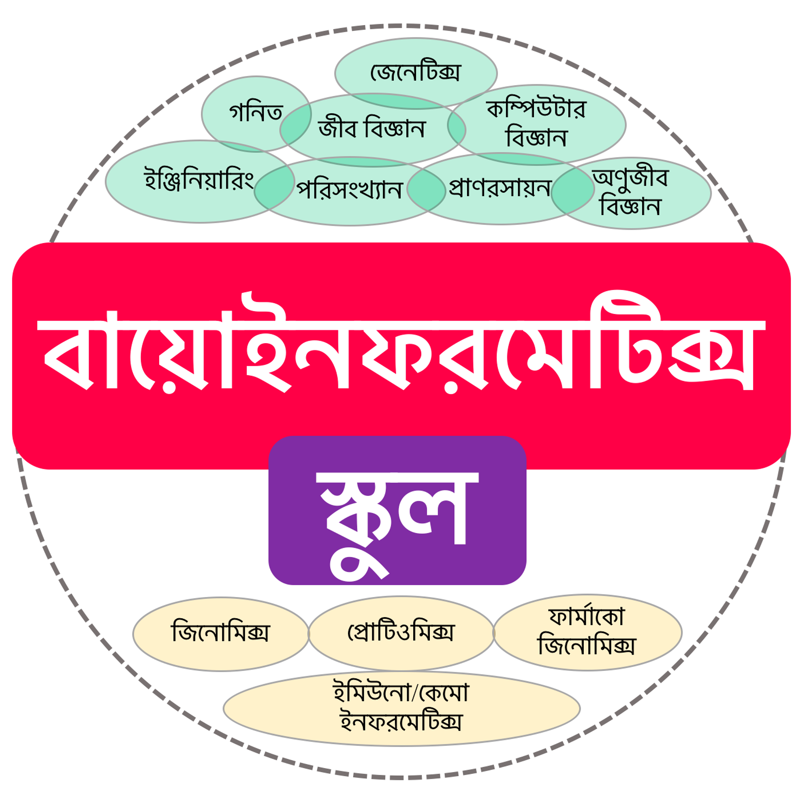

[](https://youtu.be/bdr39VWjk0M "Everything Is AWESOME")

## R প্রোগ্রামিং এর ডেটা স্ট্রাকচার ও উদাহরণ

R প্রোগ্রামিং এ আমরা  বিভিন্ন ধরনের ডেটা নিয়ে কাজ করতে পারি বিশেষ করে টেবিল ডেটা, যেখানে ডেটা সারি ও কলাম আকারে সাজানো থাকে। R প্রোগ্রামিং ৫ ধরনের ডেটা স্ট্রাকচার (Data structure) ব্যবহার করে থাকে, যেমন `vector`, `matrix`, `list`, `dataframe` ও  `factor`। এখানে ডেটা স্ট্রাকচার বলতে বোঝাচ্ছে কিভাবে  R প্রোগ্রামিং ল্যাঙ্গুয়েজ তার ডেটা সাজিয়ে রাখে সেটা।
 
একমাত্রার ডেটা যেমন ১-১০ পর্যন্ত সংখ্যা নিয়ে কাজ করার সময় `vector`, `list` ও `factor` ব্যবহার করা যেতে পারে। আবার দুই মাত্রার ডেটা নিয়ে কাজ করার সময় `matrix` বা, `dataframe` ব্যবহার করা যেতে পারে। দুইমাত্রার ডেটার হচ্ছে যেখানে ডেটা সারি ও কলাম আকারে সাজানো থাকে। বিভিন্ন প্রয়োজনে বিভিন্ন ডেটা স্ট্রাকচার ব্যবহার করা হয়।  
আবার প্রয়োজনে এক ডেটা স্ট্রাকচার থেকে অন্য ডেটা স্ট্রাকচারে রূপান্তর করা যায়। 

>একমাত্রার ডেটা নিয়ে কিভাবে কাজ করতে হবে তার কিছু উদাহরণ দেয়া হল। 

```{r}
#print 1 t0 10
1:10
#print first 6 English letters in lowercase
letters[1:6]
LETTERS[1:6]
#save as an object
x = c(1:10)
class(x)
y = LETTERS[1:6]
class(y)
#make list. list একটা ভেক্টর যে অন্য অবজেক্ট জমা রাখে, যেমন নিচের উদাহরণে z অবজেক্ট  x ও y রেখেছে। 
z = list(x,y)
class(z)

#convert the numeric vector x to a character vector 
x_character = as.character(x)
class(x)

#try yourself for other conversions.
```
 
>দুইমাত্রার ডেটা নিয়ে কিভাবে কাজ করতে হবে তার কিছু উদাহরণ দেখে নেয়া যাক। 

```{r}
#make two objects of equal length, x and y
x = c(1:10)
class(x)
length(x)
y = LETTERS[1:10]
length(y)

#make dataframe and store in an object, xy.
xy = data.frame(x, y)
class(xy)

#check column name
colnames(xy)

#change column name
colnames(xy) = c(“numbers”, “letters”)
```

যদি x ও y সমান আকারের না হয় তাহলে আমরা এই এরর মেসেজটি পাব। 

```{r, eval = FALSE}
x = c(1:10)
length(x)
y = LETTERS[1:6]
length(y)
xy = data.frame(x, y)
```

ম্যাট্রিক্স ও ডেটাফ্রেম দুইমাত্রার ডেটা নিয়ে কাজ করলে একটু পার্থক্য রয়েছে। যেমন ম্যাট্রিক্স হচ্ছে হোমোজেনাস অর্থাৎ মেট্রিক্সের সবগুলা কলাম একি ডেটাটাইপ দিয়ে গঠিত হবে যেমন, সবগুলা কলাম নিউমেরিক অথবা সবগুলা কলাম ক্যারেক্টার দিয়ে তৈরি হবে, কিন্তু কিন্তু দুই ধরনের ডেটাটাইপ একসাথে থাকবেনা মেট্রিক্সে। অপরদিকে ডেটাফ্রেমে যেকোন ধরনের ডেটাটাইপ একসাথে থাকতে পারে এবং বলা হয় হেটেরোজেনাস। ম্যাট্রিক্স বিভিন্নভাবে তৈরি করা যায়। ম্যাট্রিক্স তৈরির কিছু উদাহরণঃ 

```{r}
##make matrix from dataframe
#take the previous dataframe as an example
x = c(1:10)
y = LETTERS[1:10]
xy = data.frame(x, y)
class(xy)

#convert the dataframe, xy into matrix
xy_matrix = matrix(xy)
class(xy_matrix)

##vector to matrix
#make a matrix of 2 rows and 3 columns from a vector x.
x = c(1:12)
x_matrix = matrix(x, nrow = 2, ncol = 3) 
class(x_matrix)

#make a matrix of 3 rows and 2 columns from a vector x.
x_matrix2 = matrix(x, nrow = 2, ncol = 3) 
class(x_matrix2)
```

ম্যট্রিক্সে কলাম ও রোকে পক্ষান্তরিত করা (transpose) যায় খুব সহজে। কলামগুলোকে রোতে বা রোগুলোকে কলামে পরিণত করা যায় এভাবে। 

```{r}
#make a matrix and transpose rows and columns
x = c(1:12)
x_matrix = matrix(x, nrow = 2, ncol = 3) 
class(x_matrix)

x_matrix_transpose = t(x_matrix) #t() for transpose 
#print the transposed matrix on the console
x_matrix_transpose
class(x_matrix_transpose)
```

নতুন সেশন শুরু করার আগে পুরনো সেশনের তথ্য মুছে ফেলুন। 

```{r}
#show all object and files
ls()

#delete all objects of the current session
rm(list=ls(all=TRUE)) #`rm` means remove and `all=TRUE` means remove all objects.
```

## অনুশীলনীঃ 

১) একটি ভেক্টরকে, x কে ডেটাফ্রেম y রূপান্তর করুন। 

২) একটি ডেটাফ্রেম, x তৈরি করেন যেখানে A,B,C,D ও F এই ৫টি কলাম থাকবে a থেকে j পর্যন্ত ১০ টি সারি থাকবে। ১-৫০ পর্যন্ত সংখ্যা ১০ টি করে পর্যায়ক্রমে ৫ টি কলামে থাকবে। 

```{r, eval = FALSE}
> x
   A  B  C  D  E
a  1 11 21 31 41
b  2 12 22 32 42
c  3 13 23 33 43
d  4 14 24 34 44
e  5 15 25 35 45
f  6 16 26 36 46
g  7 17 27 37 47
h  8 18 28 38 48
i  9 19 29 39 49
j 10 20 30 40 50
```
৩) ডেটাফ্রেম থেকে মেট্রিক্সঃ ম্যাট্রিক্স থেকে ডেটাফ্রেম করার উপায়টা নিজেরা বের করে নিন।


## Script

[ক্লাসের script পাওয়া যাবে এখানে](https://github.com/Rashedul/R-Tutorials/blob/master/scripts/Lec-03.R) 


## 

##


<p align="center">
  <b>Follow বায়োইনফরমেটিক্স স্কুল:</b><br>
  <a href="https://www.facebook.com/%E0%A6%AC%E0%A6%BE%E0%A6%AF%E0%A6%BC%E0%A7%8B%E0%A6%87%E0%A6%A8%E0%A6%AB%E0%A6%B0%E0%A6%AE%E0%A7%87%E0%A6%9F%E0%A6%BF%E0%A6%95%E0%A7%8D%E0%A6%B8-%E0%A6%B8%E0%A7%8D%E0%A6%95%E0%A7%81%E0%A6%B2-575599666193690/">facebook page</a> |
  <a href="https://www.facebook.com/groups/390262838074549/">facebook group</a> |
  <a href="https://www.youtube.com/channel/UCm-8CdrvGi2SjLEOUSCztIg?view_as=subscriber">YouTube</a>
  <br><br>
  
</p>